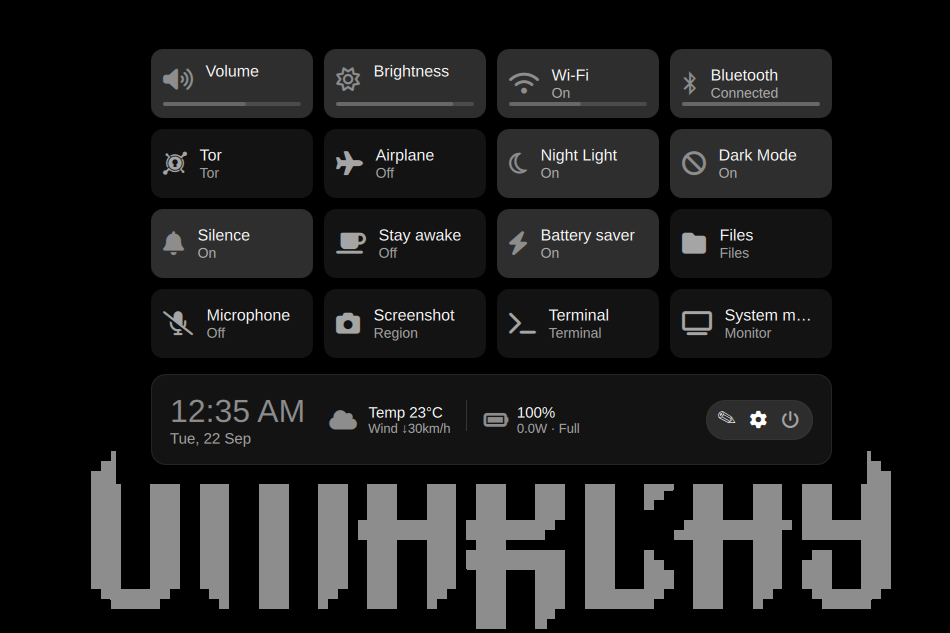

# Control Center for Omarchy

A compact, keyboard-first quick-settings hub for the
[Omarchy](https://omarchy.org/) shell (Hyprland + Quickshell). It combines
live system controls, provider panels, and installed-plugin launchers in one
theme-aware popup.



## Features

- Symmetric 4×4 quick-control grid with compact, labelled cards
- Live volume and brightness meters; normal PipeWire 100% fills the full bar
- Wi-Fi signal and Bluetooth link/RSSI meters
- Today's weather (when configured) plus live battery percentage, state, and
  wattage in the status strip
- Theme-aware surfaces, text, borders, and accent state
- Physical 12×12px top-corner triggers with a 120ms dwell
- Keyboard navigation, Edit mode, provider selection, and plugin add cards
- Universal pointer contract: left-click opens a provider; right-click runs a
  declared state action; launch-only plugins never pretend to be toggles

## Install

From the published repository:

```bash
omarchy plugin add https://github.com/404Prabhat/omarchy-control-center.git --enable
```

Open it with the physical top-left hot corner or:

```bash
omarchy-shell shell toggle a.control-center
```

### Local install

```bash
omarchy plugin add /path/to/omarchy-control-center --enable
```

### Update and removal

```bash
omarchy plugin update a.control-center
omarchy plugin remove a.control-center
```

## Requirements

- Omarchy shell with Quickshell plugin support
- JetBrainsMono Nerd Font
- Per-capability optional commands: `nmcli`, `bluetoothctl`, `gsettings`,
  `brightnessctl`, `powerprofilesctl`, and a provider's own command-line tool

Missing optional backends hide only their dependent tile.

## Privacy and security

The plugin runs inside `omarchy-shell` with the user's permissions. It reads
local system state from PipeWire, NetworkManager (`nmcli`), BlueZ
(`bluetoothctl`), supported provider commands, `/sys/class/power_supply`, and
Omarchy's configured weather status command when weather is enabled.
It writes only its own grid/binding preferences after an explicit edit. It
does not send telemetry over the network, collect credentials, or use elevated
privileges. Review source before enabling any third-party Omarchy plugin.

## Repository layout

| File | Role |
|---|---|
| `manifest.json` | Plugin identity and Omarchy entry point |
| `Panel.qml` | UI, live telemetry, interactions, and poller |
| `Model.js` | Capability model and pure-JS helpers |
| `control-center.json` | Built-in capability contracts |

## License

MIT — see [LICENSE](LICENSE).
